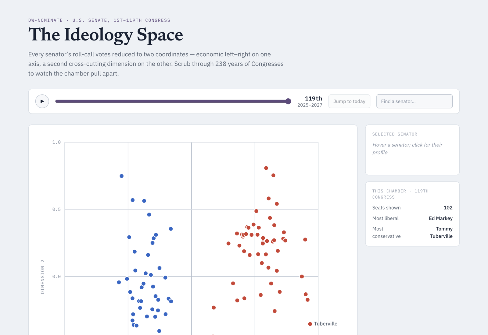
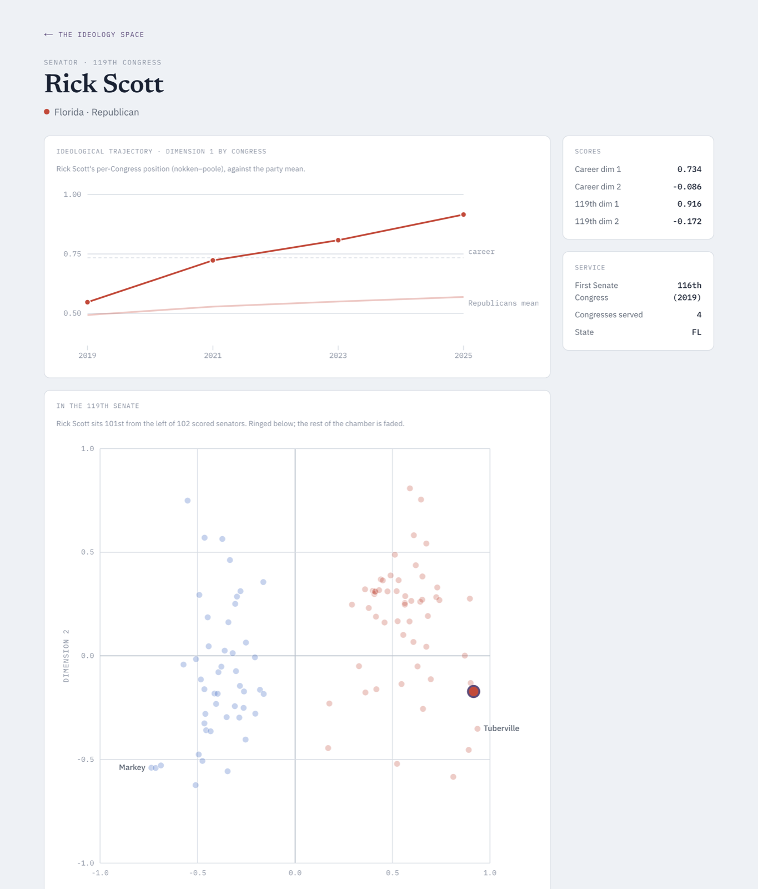

# InsideGov

**[insidegov.fyi](https://insidegov.fyi)** ·
every member of Congress's voting record reduced to a point in a
two-dimensional ideology space, from the 1st Congress (1789) to the 119th
(2025–27).



Political scientists have spent decades boiling roll-call votes down to a
low-dimensional "ideal point" per legislator — the **DW-NOMINATE** score. This
site makes that data explorable:

- **Scrub through 236 years** and watch the Senate go from an undifferentiated
  cloud to two hard-separated partisan clusters.
- **Compare a state's two senators** — the dumbbell chart sorts every
  delegation by how far apart its pair sits.
- **Read any current senator's trajectory** — a per-Congress line showing how
  their score has moved, against their party's mean.
- Party-mean trend line, a searchable roster, a full data table, and a
  profile page for each of the ~100 current senators.

<!--
WHY I BUILT THIS
Corbett — write this section. A few honest sentences: what pulled you to this
data, what you wanted to be able to see that existing tools don't show, and
what you got out of building it. Keep it personal; it's the part a reader
remembers.
-->



## Data

| Source | Used for |
| --- | --- |
| [**Voteview**](https://voteview.com/) (Lewis, Poole, Rosenthal, Boche, Rudkin & Sonnet) | DW-NOMINATE ideal points — the static career score and the per-Congress (Nokken–Poole) score |
| [**@unitedstates/congress-legislators**](https://github.com/unitedstates/congress-legislators) | Names, states, parties, terms, and the `icpsr` ↔ `bioguide_id` crosswalk |
| [**@unitedstates/images**](https://github.com/unitedstates/images) | Official member portraits (current members only), committed under `public/images/members/` |

> Lewis, Jeffrey B., Keith Poole, Howard Rosenthal, Adam Boche, Aaron Rudkin,
> and Luke Sonnet (2026). *Voteview: Congressional Roll-Call Votes Database.*
> voteview.com

Raw snapshots are committed under `pipeline/raw/`, so builds are reproducible
and don't touch the network. A scheduled GitHub Action re-fetches Voteview
weekly and opens a PR if it changed — see
[`.github/workflows/voteview-freshness.yml`](.github/workflows/voteview-freshness.yml).
Data conventions (why `bioguide_id` is the only join key, why the two
DW-NOMINATE scores must not be conflated) are written down in
[`docs/DATA_CONVENTIONS.md`](docs/DATA_CONVENTIONS.md).

## How it's built

- **Next.js 16** (App Router) + **React 19** + **TypeScript**, **Tailwind v4**
  themed from a small set of CSS custom properties (light/dark).
- **A build-time data pipeline**, not a database. `pipeline/` fetches the raw
  files, validates every row against a Zod schema, and transforms them into
  normalized JSON (`legislators.json`, `terms.json`, `ideology_scores.json`,
  `id_crosswalk.json`). The app reads those at build time and statically
  prerenders every page — there is no runtime data fetching and nothing to
  operate.
- **D3 for the maths only** (`d3-scale`, `d3-shape`) — scales and path strings.
  Every `<circle>`, `<path>` and `<line>` is plain JSX, so React owns the DOM.
  Three shared primitives (`ChartFrame`, `Axis`, `Tooltip`) back all four
  chart types.
- **CI** (`.github/workflows/ci.yml`) type-checks, lints, runs the unit tests,
  re-runs the pipeline and fails if the committed output drifts, then builds.

```
app/          routes — the explorer (/) and member profiles
components/    charts/ (primitives), senate/ (the ideology views), profile/
lib/           the build-time data layer + shared helpers
pipeline/      fetch → validate → transform → pipeline/output/*.json
public/        static assets, incl. committed member photos (images/members/)
docs/          DATA_CONVENTIONS.md, CREDITS.md
```

## Running locally

```bash
pnpm install
pnpm dev          # http://localhost:3000
```

Node ≥ 20.9. Other commands:

```bash
pnpm build          # production build
pnpm typecheck      # next typegen && tsc --noEmit
pnpm test           # vitest
pnpm pipeline       # fetch + validate + transform (re-fetches from source)
pnpm pipeline:check # validate + transform + assert pipeline/output is unchanged
```

## Scope

Current senators only, for now. Historical/former senators, the House (the
pipeline already carries the data), committees, and financial disclosures are
future work.

## Licence

Personal project — the code isn't licensed for reuse yet. The underlying data
belongs to its sources: Voteview data is free for scholarly and public use
with attribution; congress-legislators is public-domain (CC0).
