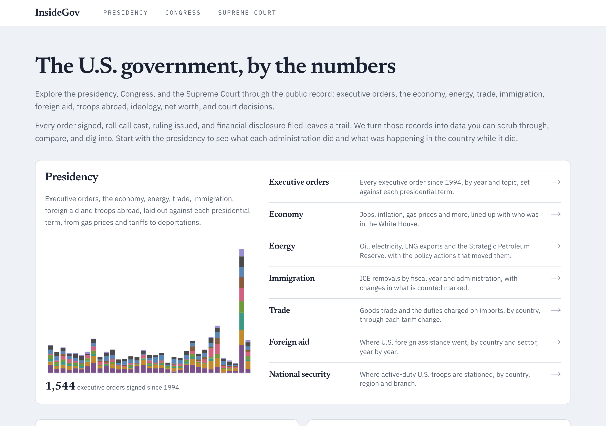
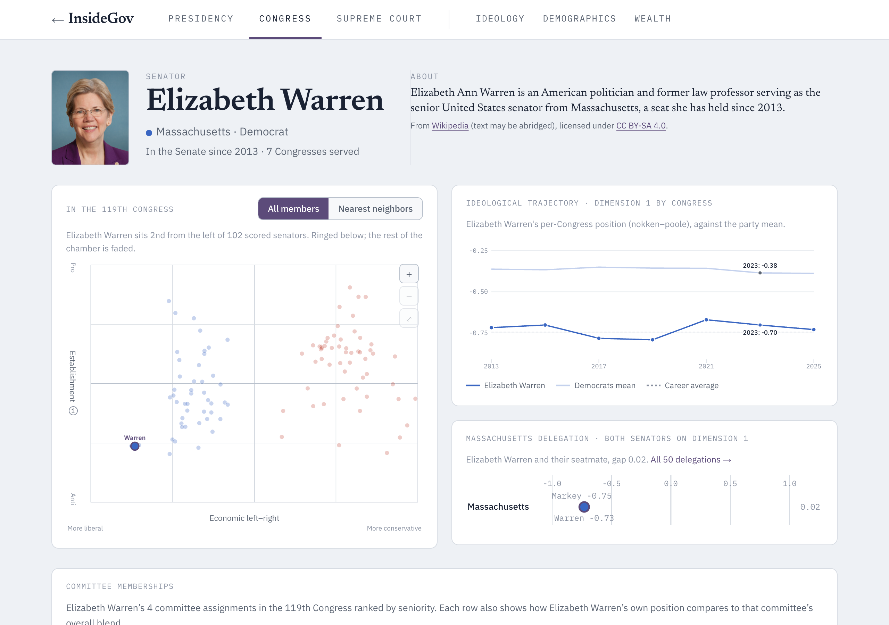

# InsideGov

**[insidegov.fyi](https://insidegov.fyi)** ·
every member of Congress's voting record reduced to a point in a
two-dimensional ideology space, from the 1st Congress (1789) to the 119th
(2025–27).



Political scientists have spent decades boiling roll-call votes down to a
low-dimensional "ideal point" per legislator — the **DW-NOMINATE** score. This
site makes that data explorable:

- **Scrub through 236 years** and watch each chamber go from an undifferentiated
  cloud to two hard-separated partisan clusters.
- **Compare a state's delegation** — the dumbbell / range chart sorts every
  delegation by how far apart its members sit.
- **Read any current member's trajectory** — a per-Congress line showing how
  their score has moved, against their party's mean.
- **See where a committee sits** — every House, Senate, and joint committee of
  the 119th Congress blended to a point, plus a page per committee.
- **Congressional net worth** ([`/congress/wealth`](https://insidegov.fyi/congress/wealth))
  — where they started, where they are now: first vs. latest net worth on a
  shared signed-log scale, highest/lowest lists, and a "Net worth over time"
  card with the actual assets and liabilities on every current member's
  profile page, estimated from their annual financial disclosures.
- Party-mean trend line, a searchable roster, a full data table, and a
  profile page for every current representative and senator.

<!--
WHY I BUILT THIS
Corbett — write this section. A few honest sentences: what pulled you to this
data, what you wanted to be able to see that existing tools don't show, and
what you got out of building it. Keep it personal; it's the part a reader
remembers.
-->



## Data

| Source | Used for |
| --- | --- |
| [**Voteview**](https://voteview.com/) (Lewis, Poole, Rosenthal, Boche, Rudkin & Sonnet) | DW-NOMINATE ideal points — the static career score and the per-Congress (Nokken–Poole) score |
| [**@unitedstates/congress-legislators**](https://github.com/unitedstates/congress-legislators) | Names, states, parties, terms, the `icpsr` ↔ `bioguide_id` crosswalk, and current committees + rosters |
| [**@unitedstates/images**](https://github.com/unitedstates/images) | Official member portraits (current members only), committed under `public/images/members/` |
| [**Wikipedia**](https://en.wikipedia.org/) (CC BY-SA 4.0) | The short, abridged bio in each current member's profile header, fetched at build time (`pipeline/fetch/wikipedia.ts`) |
| **House Clerk** ([disclosures-clerk.house.gov](https://disclosures-clerk.house.gov/)) and **Senate eFD** ([efdsearch.senate.gov](https://efdsearch.senate.gov/)) | Annual financial disclosures (assets, liabilities, net worth bands) behind `/congress/wealth` and each profile's net worth card |

> Lewis, Jeffrey B., Keith Poole, Howard Rosenthal, Adam Boche, Aaron Rudkin,
> and Luke Sonnet (2026). *Voteview: Congressional Roll-Call Votes Database.*
> voteview.com

Raw snapshots are committed under `pipeline/raw/`, so builds are reproducible
and don't touch the network. A scheduled GitHub Action re-fetches Voteview
weekly and opens a PR if it changed — see
[`.github/workflows/voteview-freshness.yml`](.github/workflows/voteview-freshness.yml).
Wikipedia bios are refreshed the same way
([`wikipedia-freshness.yml`](.github/workflows/wikipedia-freshness.yml)).
Data conventions (why `bioguide_id` is the only join key, why the two
DW-NOMINATE scores must not be conflated) are written down in
[`docs/DATA_CONVENTIONS.md`](docs/DATA_CONVENTIONS.md).

## How it's built

- **Next.js 16** (App Router) + **React 19** + **TypeScript**, **Tailwind v4**
  themed from a small set of CSS custom properties (light/dark).
- **A build-time data pipeline**, not a database. `pipeline/` fetches the raw
  files, validates every row against a Zod schema, and transforms them into
  normalized JSON (`legislators.json`, `terms.json`, `ideology_scores.json`,
  `id_crosswalk.json`, `committees.json`, `committee_memberships.json`). The app
  reads those at build time and statically prerenders every page — there is no
  runtime data fetching and nothing to operate. Financial disclosures are a
  separate Python sidecar (`pipeline/financial_disclosures/`, PDF/HTML parsing
  is easier there) producing `financial_disclosures.json` (one row per member
  per reporting year, band-count grain) and `line-items/<year>.json` (the
  verbatim per-asset/per-liability grain, sharded by year) — both validated
  the same way (Zod on the TS side, a dependency-free schema check on the
  Python side) before the app reads them.
- **D3 for the maths only** (`d3-scale`, `d3-shape`, `d3-force`) — scales, path
  strings, and the beeswarm collision layout. Every `<circle>`, `<path>` and
  `<line>` is plain JSX, so React owns the DOM. Low-level primitives
  (`ChartFrame`, `Axis`, `Tooltip`) plus the `ScatterPlot` and `SwarmRows`
  chart bodies back every view — the member and committee compasses are the
  same `ScatterPlot` with different accessors, not separate charts.
- **CI** (`.github/workflows/ci.yml`) type-checks, lints, runs the unit tests,
  re-runs the pipeline and fails if the committed output drifts, then builds.

```
app/          routes — the hub (/), the explorer (/congress), member profiles, committee pages, /congress/wealth
components/    charts/ (primitives), senate/ (the ideology views), profile/, committee/, wealth/
lib/           the build-time data layer + shared helpers
pipeline/      fetch → validate → transform → pipeline/output/*.json
                financial_disclosures/ — Python sidecar (PDF/HTML parsing) for
                financial_disclosures.json + line-items/<year>.json
public/        static assets, incl. committed member photos (images/members/)
docs/          DATA_CONVENTIONS.md, NET_WORTH_METHODOLOGY.md, CREDITS.md
```

See [`ARCHITECTURE_MAP.md`](ARCHITECTURE_MAP.md) for the data-layer, route, and
shared-component maps.

## Running locally

```bash
pnpm install
pnpm dev          # http://localhost:3000
```

Node ≥ 20.9. Other commands:

```bash
pnpm build          # production build
pnpm typecheck      # next typegen && tsc --noEmit
pnpm test           # vitest
pnpm pipeline       # fetch + validate + transform (re-fetches from source)
pnpm pipeline:check # validate + transform + assert pipeline/output is unchanged
```

## Scope

The House and the Senate, every Congress from the 1st (1789) to the 119th, with
a profile page for every current representative and senator and for every
standing committee of the 119th Congress. Committee membership is only tracked
for the current Congress (there is no historical roster file upstream), so the
committee views are pinned to the 119th and carry no trend chart.

Still future work: subcommittees and a per-member bills/votes record.

## Licence

Personal project — the code isn't licensed for reuse yet. The underlying data
belongs to its sources: Voteview data is free for scholarly and public use
with attribution; congress-legislators is public-domain (CC0).
